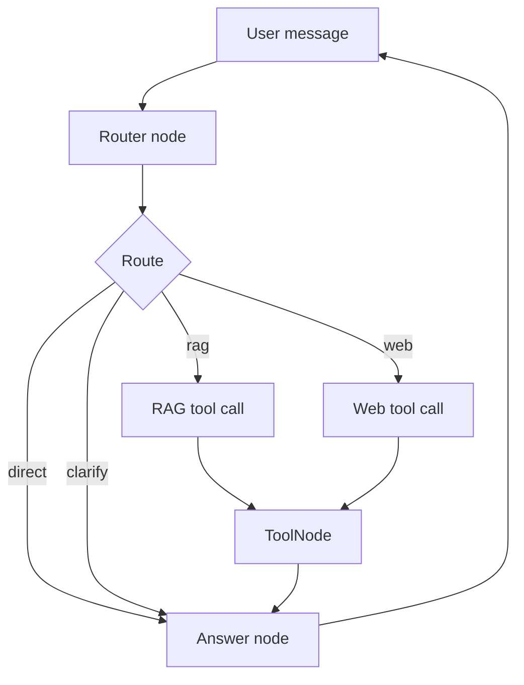
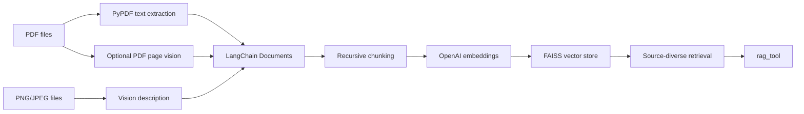

# Agentic BPMN Process Mapper

An agentic RAG application that helps analyze business-process material and
turn it into BPMN-oriented process maps. The app combines LangGraph routing,
local document retrieval, image understanding, web search, conversation memory,
and LangSmith observability inside a Streamlit chat interface.

The project is designed around a vertical use case: supporting BPMN 2.0 process
mapping from local reference documents, uploaded PDFs, and process-diagram
images.

## What It Does

- answers BPMN 2.0 and process-modeling questions using local documents
- retrieves from multiple PDFs and image files through a FAISS vector store
- reads PNG/JPEG process diagrams with a vision model before indexing them
- optionally extracts visual descriptions from selected PDF pages
- maps business processes into BPMN-oriented structures
- outputs Mermaid diagrams only when a process diagram is useful or requested
- uses Tavily web search for current or external information
- keeps multi-thread chat memory with SQLite checkpoints
- traces routing, retrieval, and generation behavior in LangSmith

## Why This Project

Business-process mapping often requires more than a generic chatbot. The
assistant needs to decide when to use internal documentation, when to search the
web, when to answer directly, and when to ask for missing process details.

This repo implements that decision layer explicitly with LangGraph instead of
leaving every step to one free-form model call.

## Agent Architecture

The graph starts with a structured router. The router classifies every user
request into one of four routes:

- `rag`: use local/uploaded documents, BPMN references, examples, or diagrams
- `web`: use web search for current, external, or regulatory information
- `direct`: answer stable general questions without tools
- `clarify`: ask for missing details when retrieval would not help



The router remains model-driven, but the harness controls execution. This makes
tool use more reliable and easier to inspect in LangSmith.

## RAG Pipeline

Documents are indexed once and reused at runtime. The index is rebuilt only when
documents are added, changed, or when `REBUILD_INDEX=true`.



The retriever intentionally pulls context from diverse sources so one large PDF
does not dominate every answer. Tool outputs are truncated before being passed
to the final model to control token usage.

## BPMN Output Style

For process-mapping requests, the assistant is guided to identify:

- process goal and trigger
- participants, pools, lanes, and roles
- tasks, subprocesses, events, and gateways
- sequence flows and message flows
- inputs, outputs, data objects, exceptions, and missing information

When a visual process map is useful, the assistant returns a fenced Mermaid
diagram. It avoids Mermaid for simple explanations, debugging, definitions, and
short factual answers.

## Streamlit Features

- multi-thread chat sidebar
- persistent conversation memory
- delete selected conversations from the UI
- upload PDFs, PNGs, JPGs, and JPEGs from the chat input
- automatic FAISS rebuild after file upload
- streaming assistant responses
- short generated conversation titles

Uploaded files are saved to `DOCUMENTS_FOLDER` and indexed immediately, so the
same chat session can use them without restarting the app.

## Project Structure

```text
.
|-- app.py              # Streamlit UI, chat streaming, uploads, sidebar
|-- graph.py            # LangGraph router, nodes, prompts, final answer logic
|-- agentic_rag.py      # PDF/image ingestion, FAISS, RAG tool, web tool
|-- memory.py           # SQLite thread metadata and checkpoint connection
|-- settings.py         # Environment-based configuration
|-- documents/          # Private local documents, ignored except .gitkeep
|-- .env.example        # Environment variable template
|-- pyproject.toml
`-- README.md
```

## Setup

Install dependencies:

```bash
uv sync
```

Create a local environment file:

```bash
cp .env.example .env
```

Add your API keys:

```env
OPENAI_API_KEY=your_openai_api_key_here
TAVILY_API_KEY=your_tavily_api_key_here
```

Run the app:

```bash
uv run streamlit run app.py
```

## Environment Variables

Core configuration:

```env
OPENAI_MODEL=gpt-4.1-mini
OPENAI_VISION_MODEL=gpt-4.1-mini
FINAL_MAX_COMPLETION_TOKENS=3000
ANSWER_MAX_CONTINUATIONS=2
```

RAG configuration:

```env
DOCUMENTS_FOLDER=documents
FAISS_INDEX_PATH=faiss_index_documents
REBUILD_INDEX=false
MAX_RETRIEVAL_DOCS=6
MAX_SOURCE_RETRIEVAL_DOCS=1
MAX_DIVERSE_SOURCES=5
```

LangSmith tracing:

```env
LANGSMITH_TRACING=true
LANGSMITH_ENDPOINT=https://api.smith.langchain.com
LANGSMITH_API_KEY=your_langsmith_api_key_here
LANGSMITH_PROJECT=agentic-rag
```

PDF vision is optional:

```env
PDF_VISION_ENABLED=false
PDF_VISION_MAX_PAGES=25
PDF_VISION_PAGES=
PDF_VISION_DPI=160
PDF_VISION_CACHE_PATH=vision_cache.json
```

To analyze selected PDF pages visually:

```env
PDF_VISION_ENABLED=true
PDF_VISION_PAGES=1,3,10-12
```

If `PDF_VISION_PAGES` is empty, the app uses the first
`PDF_VISION_MAX_PAGES` pages.

## Document Privacy

This repository is prepared so local knowledge-base files are not pushed:

- `.env` is ignored
- local PDFs/images in `documents/` are ignored
- FAISS indexes are ignored
- SQLite memory files are ignored
- `vision_cache.json` is ignored

Only `documents/.gitkeep` is intended to be tracked.

## Notes

The assistant is not a BPMN execution engine. It is a process-analysis and
modeling assistant: it retrieves evidence, proposes BPMN structures, highlights
ambiguities, and asks follow-up questions when process details are missing.
